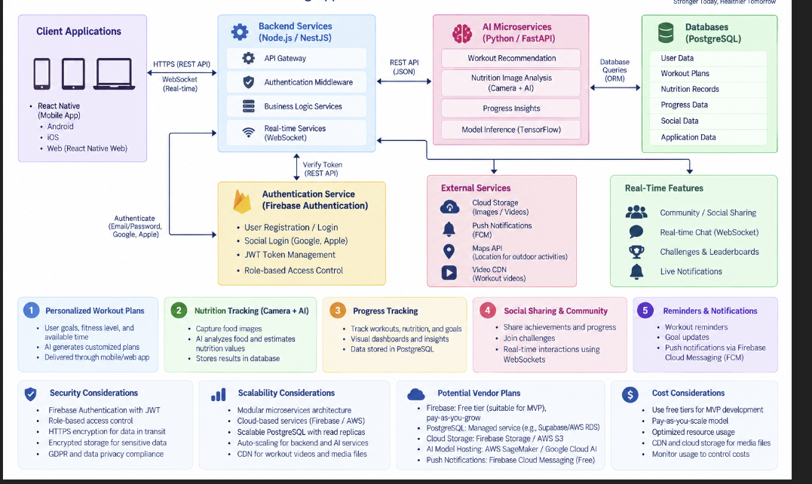
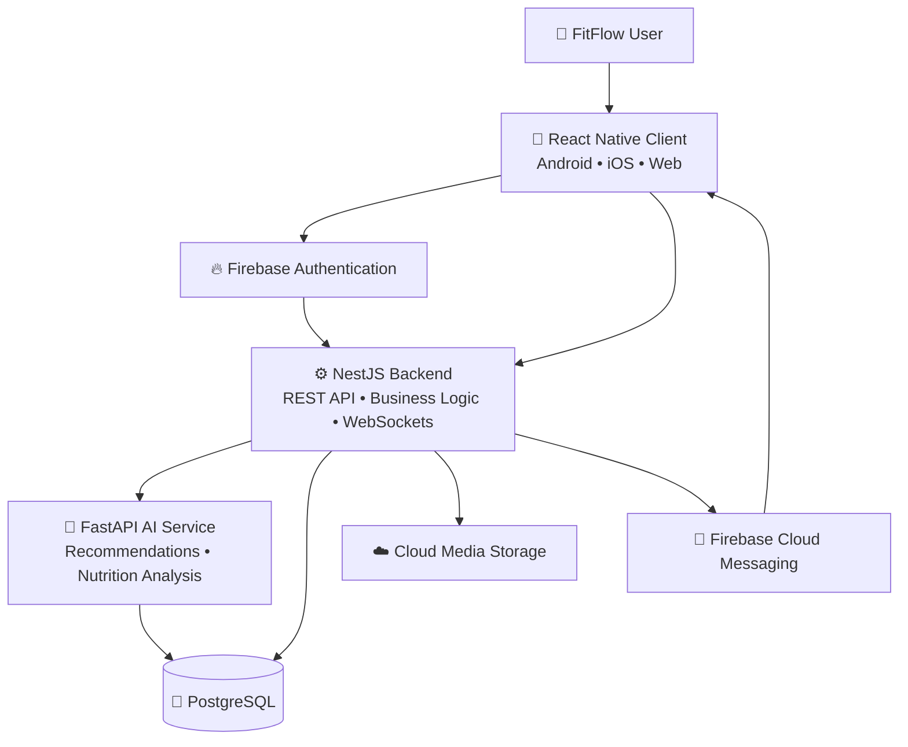

<div align="center">

# 🏋️ FitFlow Redesign

### ✨ Cross-Platform Fitness • AI Personalization • Secure by Design


**Prepared for:** IT3060 – Human Computer Interaction  
**Student:** B A W CHATHURANGA  
**Student ID:** IT23838352  
**Class:** Y3 S2 WE 06 01

---

> 💡 This repository organizes the technology evaluation, decision matrix, selected technology stack, high-level architecture, ADR, and initial project structure for the FitFlow redesign.

</div>

---

## 📌 Table of Contents

- [🎯 Project Overview](#-project-overview)
- [🧭 Project Goals](#-project-goals)
- [🏆 Selected Technology Stack](#-selected-technology-stack)
- [💡 Why This Stack?](#-why-this-stack)
- [📊 Technology Decision Summary](#-technology-decision-summary)
- [🏗️ High-Level Architecture](#️-high-level-architecture)
- [🔄 Core Data Flows](#-core-data-flows)
- [🔐 Security and Privacy](#-security-and-privacy)
- [📁 Repository Structure](#-repository-structure)
- [🚀 Getting Started](#-getting-started)
- [🛠️ CI/CD](#️-cicd)
- [📚 Documentation](#-documentation)
- [⚠️ Scope and Limitations](#️-scope-and-limitations)
- [👤 Author](#-author)

---

## 🎯 Project Overview

FitFlow is a fitness application redesign that requires a seamless experience across Android, iOS, and web while supporting AI-powered and real-time features.

Main focus areas include:

- 🏋️ Personalized workout recommendations
- 📷 Camera-based nutrition tracking
- 📈 Progress monitoring and dashboards
- 👥 Social/community features
- 🔔 Notifications and reminders
- 🤖 AI-assisted recommendations and nutrition analysis
- 🔐 Secure authentication
- 🌐 Cross-platform delivery

---

## 🧭 Project Goals

| Goal | Description |
|---|---|
| 📱 Cross-platform experience | Provide a consistent experience across Android, iOS, and web |
| ⚡ Performance | Support smooth workouts, dashboards, and camera-based features |
| ♻️ Code reuse | Reduce duplicated development work |
| 🤖 AI readiness | Support personalized recommendations and nutrition analysis |
| 💬 Real-time interaction | Support notifications, social features, and live updates |
| 🔐 Security | Protect personal fitness and health-related information |
| 📈 Scalability | Support future growth in users and data |
| 🛠️ Maintainability | Keep the system manageable for a mid-sized team |
| 💰 Cost awareness | Use practical and affordable technology choices |

---

## 🏆 Selected Technology Stack

| Layer | Selected Technology | Primary Role |
|---|---|---|
| 📱 Frontend | **React Native + React Native Web** | Android, iOS, and web user interfaces |
| ⚙️ Main Backend | **Node.js / NestJS** | APIs, business logic, real-time features |
| 🤖 AI Service | **Python / FastAPI** | Workout recommendation and nutrition analysis |
| 🗄️ Database | **PostgreSQL** | Structured health, workout, nutrition, and progress data |
| 🔐 Authentication | **Firebase Authentication** | Secure user registration and login |
| 🔔 Notifications | **Firebase Cloud Messaging** | Push notifications and reminders |
| ☁️ Media Storage | **Cloud Object Storage** | Images and media files |
| 🚀 CI/CD | **GitHub Actions** | Basic repository validation |

---

## 💡 Why This Stack?

### ⚛️ React Native

React Native is recommended because it offers high code reuse across Android and iOS and can support web development through React Native Web.

**Key benefits**
- Fast development
- Large JavaScript/React ecosystem
- Native camera and notification access
- Strong Firebase support
- WebSocket support for real-time features
- Good fit for a cross-platform FitFlow experience

### 🟥 Node.js / NestJS

Node.js / NestJS is selected for the main backend because it supports fast API development and real-time application requirements.

**Responsibilities**
- REST APIs
- Business logic
- Authentication middleware
- Real-time WebSocket services
- Social/community operations
- Database communication
- AI service integration

### 🤖 Python / FastAPI

FastAPI is used as a separate AI microservice because Python provides a strong machine-learning ecosystem.

**Suitable for**
- Workout recommendations
- Nutrition image analysis
- AI/ML inference
- Future recommendation models

### 🐘 PostgreSQL

PostgreSQL is selected because it is well suited for structured health and fitness data.

**Key strengths**
- ACID compliance
- Complex queries and joins
- Reliable relational data modeling
- Strong consistency
- Mature indexing and reporting support

### 🔥 Firebase Authentication

Firebase Authentication is selected because it is easy to integrate, scalable, and suitable for a mid-sized development team.

**Planned capabilities**
- Email/password login
- Phone authentication
- Google and Apple sign-in
- Secure token-based authentication

---

## 📊 Technology Decision Summary

The lab report uses the following main criteria and weights:

| Criterion | Weight |
|---|---:|
| ⚡ Performance | 20% |
| 📈 Scalability | 15% |
| 🚀 Development Speed | 15% |
| 🔐 Security | 15% |
| 💰 Cost | 10% |
| 🤖 AI/ML Support | 10% |
| 💬 Real-Time Support | 10% |
| 🛠️ Maintainability | 5% |

The weighted scores below are reproduced from the submitted lab report:

| Technology | Weighted Score |
|---|---:|
| React Native | **4.80 / 5** |
| Node.js / NestJS | **4.70 / 5** |
| PostgreSQL | **4.35 / 5** |
| Firebase Authentication | **4.75 / 5** |

---

## 🏗️ High-Level Architecture



The architecture separates client applications, backend services, AI services, authentication, database access, and supporting external services.



---

## 🔄 Core Data Flows

### 🏋️ Personalized Workout Recommendation

```text
User
  ↓
React Native Client
  ↓
NestJS Backend
  ↓
FastAPI AI Service
  ↓
Recommendation Result
  ↓
PostgreSQL
  ↓
Client Dashboard
```

### 📷 Nutrition Tracking

```text
Camera / Image Input
  ↓
React Native Client
  ↓
NestJS Backend
  ↓
FastAPI Nutrition Analysis
  ↓
Structured Nutrition Record
  ↓
PostgreSQL
```

### 👥 Social / Community Features

```text
User
  ↓
Authentication Check
  ↓
NestJS Backend
  ↓
Community / Challenge Logic
  ↓
PostgreSQL + Real-Time Updates
```

### 🔔 Notifications

```text
Workout / Goal Event
  ↓
NestJS Backend
  ↓
Firebase Cloud Messaging
  ↓
React Native Client
```

---

## 🔐 Security and Privacy

| Principle | Implementation Direction |
|---|---|
| 🔒 Encryption in transit | HTTPS / TLS |
| 🗄️ Secure storage | Database and cloud-storage encryption |
| 👤 Authentication | Firebase Authentication |
| 🛡️ Authorization | Backend role/permission checks |
| 🔑 Secret management | Environment variables and `.gitignore` |
| 📉 Least privilege | Give only required access |
| 🧹 Data minimization | Store only necessary fitness/health information |
| 🌍 Privacy awareness | Follow privacy-aware design practices |

> ⚠️ Never commit real passwords, API keys, service-account keys, or `.env` files to GitHub.

---

## 📁 Repository Structure

```text
fitflow-redesign/
│
├── .github/
│   └── workflows/
│       └── repo-check.yml
│
├── frontend/
│   ├── App.tsx
│   ├── package.json
│   └── README.md
│
├── backend/
│   ├── src/
│   │   ├── main.ts
│   │   └── app.module.ts
│   ├── package.json
│   └── README.md
│
├── ai-service/
│   ├── main.py
│   ├── requirements.txt
│   └── README.md
│
├── database/
│   ├── schema.sql
│   └── README.md
│
├── docs/
│   ├── architecture/
│   │   └── fitflow-high-level-architecture.png
│   ├── adr/
│   │   └── ADR-001-technology-stack.md
│   ├── supporting-documents/
│   │   └── IT23838352-HCI-Lab-Report-05.docx
│   ├── 01-frontend-comparison.md
│   ├── 02-backend-database-auth-comparison.md
│   ├── 03-technology-comparison-matrix.md
│   ├── 04-weighted-decision-matrix.md
│   ├── 05-tech-stack-summary.md
│   └── 06-github-setup-guide.md
│
├── .env.example
├── .gitignore
└── README.md
```

---

## 🚀 Getting Started

> ℹ️ This repository is an **Activity 5 project scaffold and documentation repository**, not a completed production application.

### Clone

```bash
git clone https://github.com/YOUR_USERNAME/fitflow-redesign.git
cd fitflow-redesign
```

### Frontend

```bash
cd frontend
```

### Backend

```bash
cd backend
```

### AI Service

```bash
cd ai-service
```

### Environment Configuration

Use `.env.example` only as a reference. Do not commit real credentials.

---

## 🛠️ CI/CD

A basic GitHub Actions workflow is included at:

```text
.github/workflows/repo-check.yml
```

It checks whether the essential Activity 5 files and folders are present.

### Recommended `main` branch protection

- ✅ Block force pushes
- ✅ Prevent branch deletion
- ✅ Require pull requests before merge when collaborating
- ✅ Require successful status checks before merge

---

## 📚 Documentation

| Document | Purpose |
|---|---|
| `01-frontend-comparison.md` | Frontend framework comparison |
| `02-backend-database-auth-comparison.md` | Backend, database, and authentication comparison |
| `03-technology-comparison-matrix.md` | Summary of best technology choices |
| `04-weighted-decision-matrix.md` | Decision criteria, weights, and reported scores |
| `05-tech-stack-summary.md` | Final recommended stack |
| `ADR-001-technology-stack.md` | Architecture decision record |
| `fitflow-high-level-architecture.png` | Architecture diagram extracted from the report |
| `IT23838352-HCI-Lab-Report-05.docx` | Original supporting report |

---

## ⚠️ Scope and Limitations

This repository focuses on:

- Technology evaluation
- High-level architecture
- Repository organization
- Initial starter code
- Supporting documentation

It does not yet represent a complete production implementation.

---

## 👤 Author

**B A W CHATHURANGA**  
**Student ID:** IT23838352  
**Module:** IT3060 – Human Computer Interaction  
**Class:** Y3 S2 WE 06 01

---

<div align="center">

### 💪 FitFlow — Smarter Workouts, Healthier Choices

**React Native • NestJS • FastAPI • PostgreSQL • Firebase**

</div>
